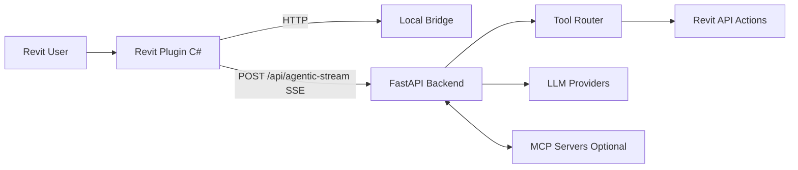

# Cora Agent Public Showcase

AI-Powered BIM Automation for Revit.

Public showcase repository for Cora Agent. This repo demonstrates product value, architecture, and safe runnable samples without exposing production internals.

[Join Waitlist](https://www.coraagent.xyz/) | [Watch Demo](https://www.coraagent.xyz/#demo) | [Pricing](https://www.coraagent.xyz/#pricing) | [Docs](https://docs.coraagent.xyz/)


## Why Cora Agent

Cora Agent turns natural language into real BIM actions inside Revit.

- 24+ BIM tools
- 10x faster modeling workflows
- 100% Revit-native integration

## Quick Summary (ES)

Cora Agent convierte lenguaje natural en acciones reales dentro de Revit.
Este repositorio es un public showcase con demo, arquitectura y samples minimos.
El core productivo permanece privado.

## Product Highlights

- AI-powered automation for repetitive BIM tasks
- Native Revit workflow via C# plugin + Python backend
- Streaming UX for fast feedback loops
- MCP-ready extensibility for tool integrations

## Demo Assets

- Hero: `assets/hero/hero-main.png`
- Thumbnail: `assets/thumbnails/demo-thumbnail.png`
- Gallery: `assets/screenshots/`
- Full videos: external links only (not stored in git)


## Feature Gallery

| Screenshot | Description |
|---|---|
|  | Natural language command flow |
|  | Revit-native sidebar UX |
|  | Intelligent model operations |
|  | Documentation and automation |

## How It Works



- Plugin reads backend URL from `BIMAGENT_API_BASE`.
- Backend streams events over `text/event-stream`.
- Tool execution applies BIM actions with validation and transaction safety.

## Quickstart (3 Steps)

1. Clone and install demo backend dependencies

```bash
git clone https://github.com/yurichamblas/Cora-Agent-Public-Showcase.git
cd Cora-Agent-Public-Showcase
python -m venv .venv
# Windows
.venv\Scripts\activate
# macOS/Linux
# source .venv/bin/activate
pip install -r samples/backend-demo/requirements.txt
```

2. Run demo backend

```bash
uvicorn app:app --app-dir samples/backend-demo --reload --port 8000
```

3. Test SSE stream

```bash
curl -N -X POST "http://127.0.0.1:8000/api/agentic-stream" \
  -H "Content-Type: application/json" \
  -d "{\"user_message\":\"Create a 6m wall on Ground Floor\",\"history\":[]}"
```

## Pricing (Brief)

The website currently presents three plans (as shown on April 7, 2026):

- Basic (On Demand): free beta credits + pay as you go
- Regular: USD 20/month
- Enterprise: USD 50/month

For latest and official pricing details: https://www.coraagent.xyz/#pricing

## Public vs Private Scope

Public in this repo:

- Landing README and visuals
- Safe sample backend with SSE
- Minimal C# sample (`Wall.Create`) for educational reference
- Security and contribution guidelines

Private in production core:

- Full orchestration logic and production prompts
- Commercial integrations and plan enforcement internals
- Production credentials, infra details, and sensitive runbooks

## Security Basics

- Never commit secrets.
- Use `.env.example` templates only.
- Keep real values in `.env.local` or secret managers.
- Secret scanning runs in pre-commit and GitHub Actions.

See [SECURITY.md](SECURITY.md) and [docs/sanitization-checklist.md](docs/sanitization-checklist.md).

## Project Structure

```text
.
|- README.md
|- assets/
|  |- hero/
|  |- logo/
|  |- screenshots/
|  |- thumbnails/
|- docs/
|  |- architecture.md
|  |- sanitization-checklist.md
|- samples/
|  |- backend-demo/
|  |- revit-plugin-sample/
|- CONTRIBUTING.md
|- SECURITY.md
|- NOTICE
|- LICENSE
```

## Brand

Cora Agent name and brand assets remain reserved by the owner. See `NOTICE`.

## Contact

- Website: https://www.coraagent.xyz/
- Docs: https://docs.coraagent.xyz/
- Email: hello@coraagent.xyz
