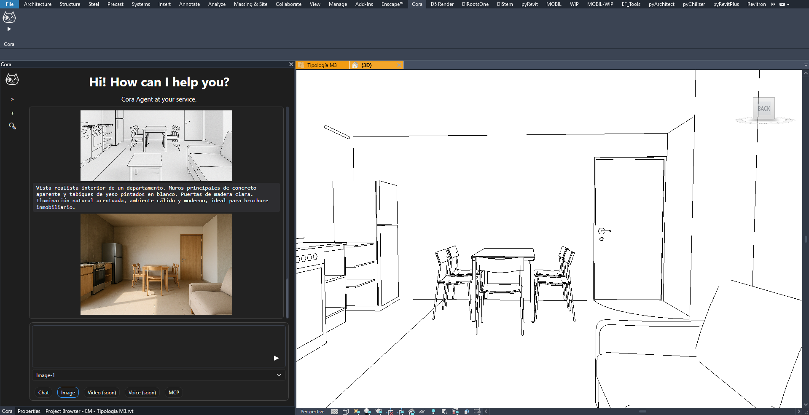
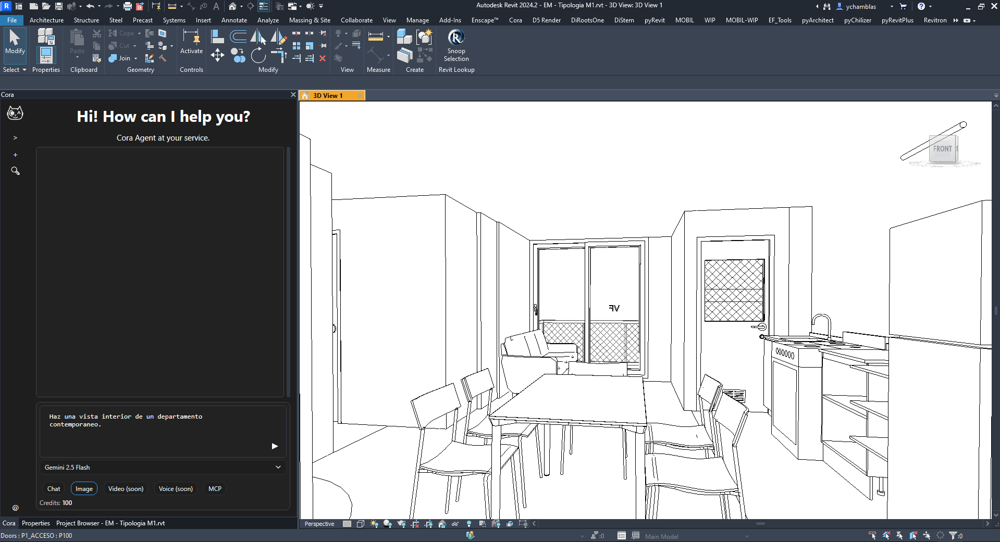
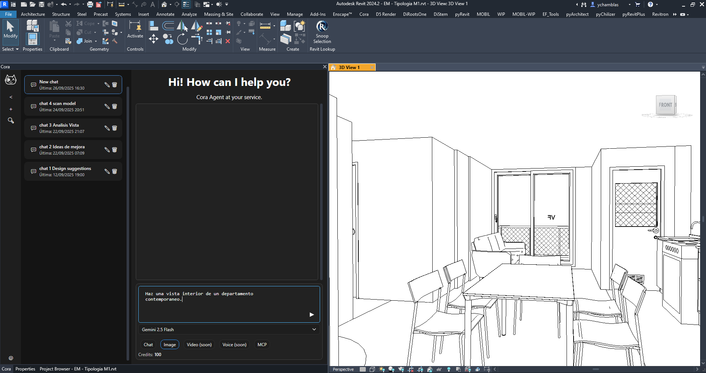
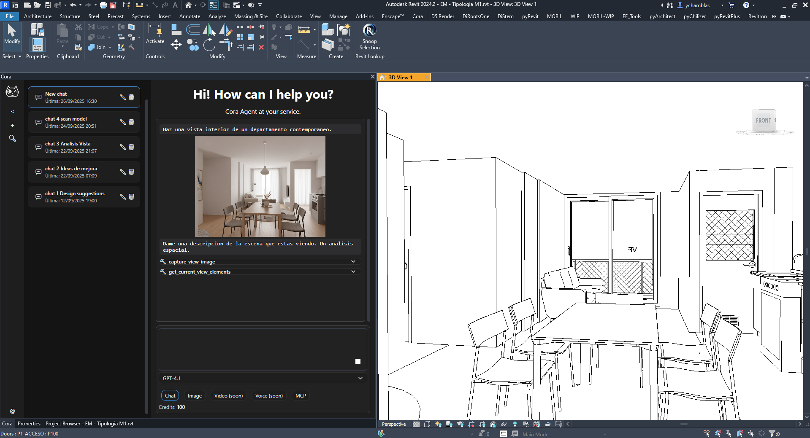
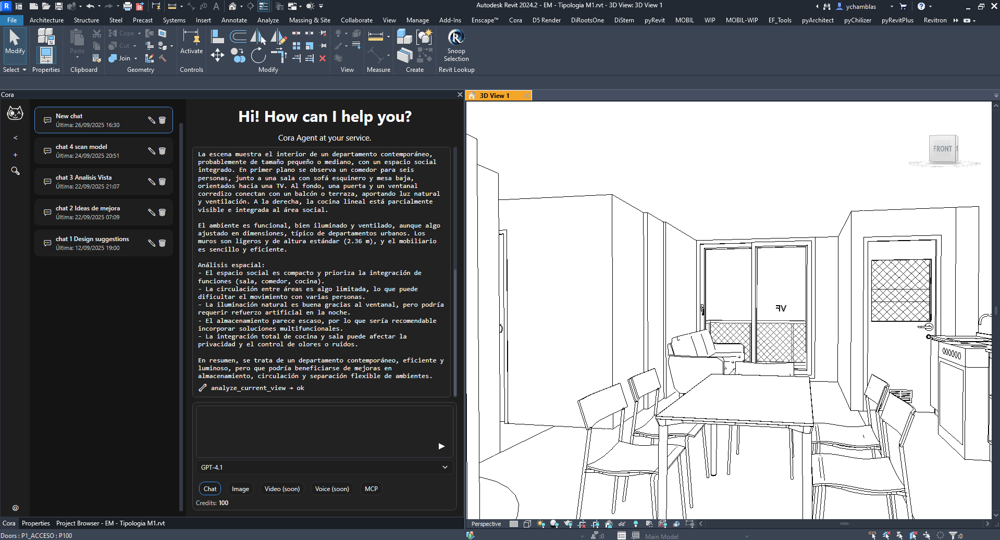
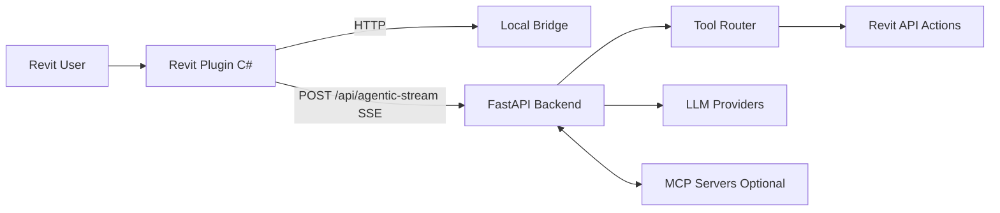

# Cora Agent Public Showcase

AI-Powered BIM Automation for Revit.

Public showcase repository for Cora Agent. This repo demonstrates product value and architecture.

[Join Waitlist](https://www.coraagent.xyz/) | [Watch Demo](https://www.coraagent.xyz/#demo) | [Pricing](https://www.coraagent.xyz/#pricing) | [Docs](https://docs.coraagent.xyz/)

## Why Cora Agent

Cora Agent turns natural language into real BIM actions inside Revit.

- 30+ BIM tools
- 10x faster modeling workflows
- 100% Revit-native integration

## Quick Summary (ES)

Cora Agent converts natural language into real-world actions within Revit.
This repository is a public showcase with a demo, architecture, and minimal samples.

## Product Highlights

- AI-powered automation for repetitive BIM tasks.
- Native Revit workflow via plugin.
- Streaming UX for fast feedback loops.
- MCP-ready extensibility for tool integrations.

## Demo Assets

- Hero: `assets/hero/hero-main.png`
- Thumbnail: `assets/thumbnails/demo-thumbnail.png`
- Gallery: `assets/screenshots/`
- Full videos: external links only (not stored in git)

## Feature Gallery

| Screenshot | Description |
|---|---|
|  | Natural language command flow |
|  | Revit-native sidebar UX |
|  | Intelligent model operations |
|  | Documentation and automation |

## How It Works

## Pricing (Brief)

Currently presents three plans (as shown on April 7, 2026):

- Basic (On Demand): free beta credits + pay as you go
- Regular: USD 20/month
- Enterprise: USD 50/month

For latest and official pricing details: https://www.coraagent.xyz/#pricing

## Brand

Cora Agent name and brand assets remain reserved by the owner. See `NOTICE`.

## Contact

- Website: https://www.coraagent.xyz/
- Docs: https://docs.coraagent.xyz/
- Email: hello@coraagent.xyz
