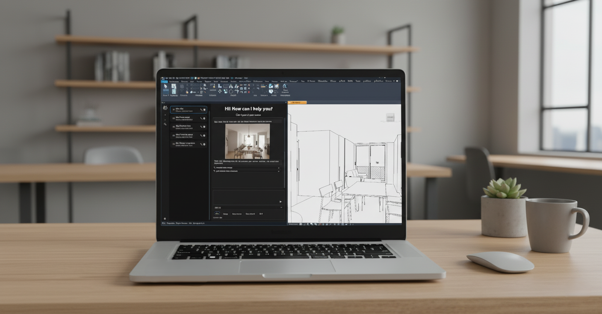
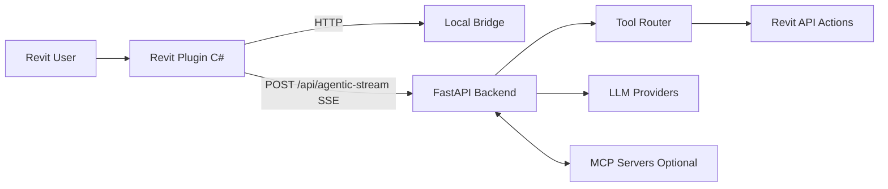

# Cora Agent Public Showcase

AI-Powered BIM Automation for Revit.

[Join Waitlist](https://www.coraagent.xyz/) | [Watch Demo](https://www.coraagent.xyz/#demo) | [Pricing](https://www.coraagent.xyz/#pricing) | [Docs](https://docs.coraagent.xyz/)

Natural language to real BIM actions in Revit. Public showcase only; production core stays private.

## Architecture

